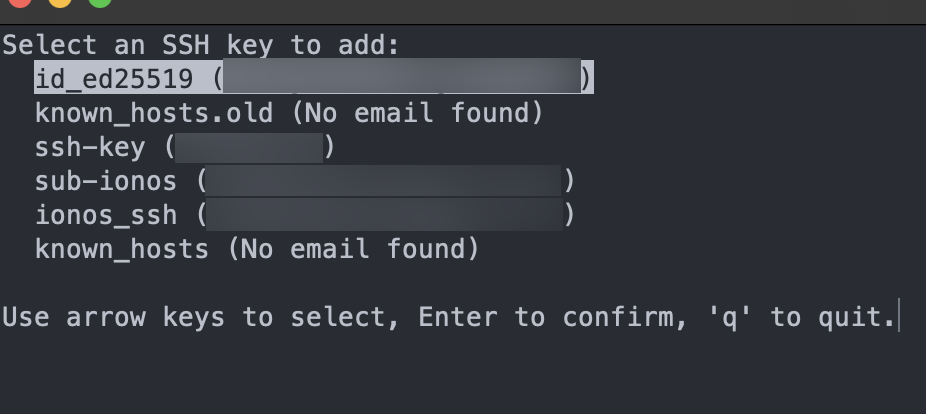
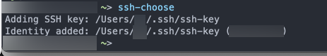

# SSH Key Chooser

This project, **SSH Key Chooser**, is a terminal-based application designed to simplify the management and selection of
SSH keys. By using the power of the `ncurses` library, it provides an interactive user interface directly within the
terminal, making the experience more intuitive and efficient compared to traditional command-line tools.

---

## Screenshots

Here are some screenshots of the **SSH Key Chooser** in action:

### Main Interface



_Description: The main interactive UI of the SSH Key Chooser displaying a list of available SSH keys._

### Selection Confirmation



_Description: A confirmation prompt after successfully selecting an SSH key._

---

## Dependencies

To build and run this project, you will need:

- A C compiler (e.g., `gcc`, `clang`)
- The `ncurses` library

### Installing `ncurses`

For different operating systems:

- **Ubuntu/Debian**:
  ```bash
  sudo apt-get install libncurses5-dev libncursesw5-dev
  ```

- **Fedora/CentOS**:
  ```bash
  sudo dnf install ncurses-devel
  ```

- **macOS**:
  Install `Homebrew` if you haven't already, then run:
  ```bash
  brew install ncurses
  ```

To confirm that `ncurses` is installed, you can run:

```bash
pkg-config --modversion ncurses
```

---

## Building the Project

1. Clone the repository:
   ```bash
   git clone https://github.com/ljunker/ssh-choose.git
   cd ssh-choose
   ```

2. Compile the project:
   ```bash
   gcc -o ssh-choose ssh_choose.c -lncurses
   ```

    - The `-lncurses` flag links the `ncurses` library to the project.

3. Run the application:
   ```bash
   ./ssh-choose
   ```

Or:
1. Install via make:
    ```bash
   make install
    ```
    this install it in ~/bin
2. Run the application from anywhere, if you have `~/bin` in your PATH
    ```bash
   ssh-choose
    ```